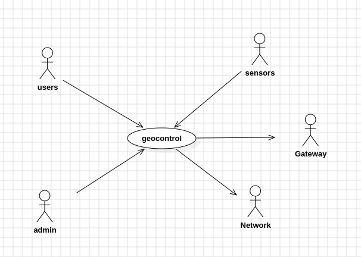
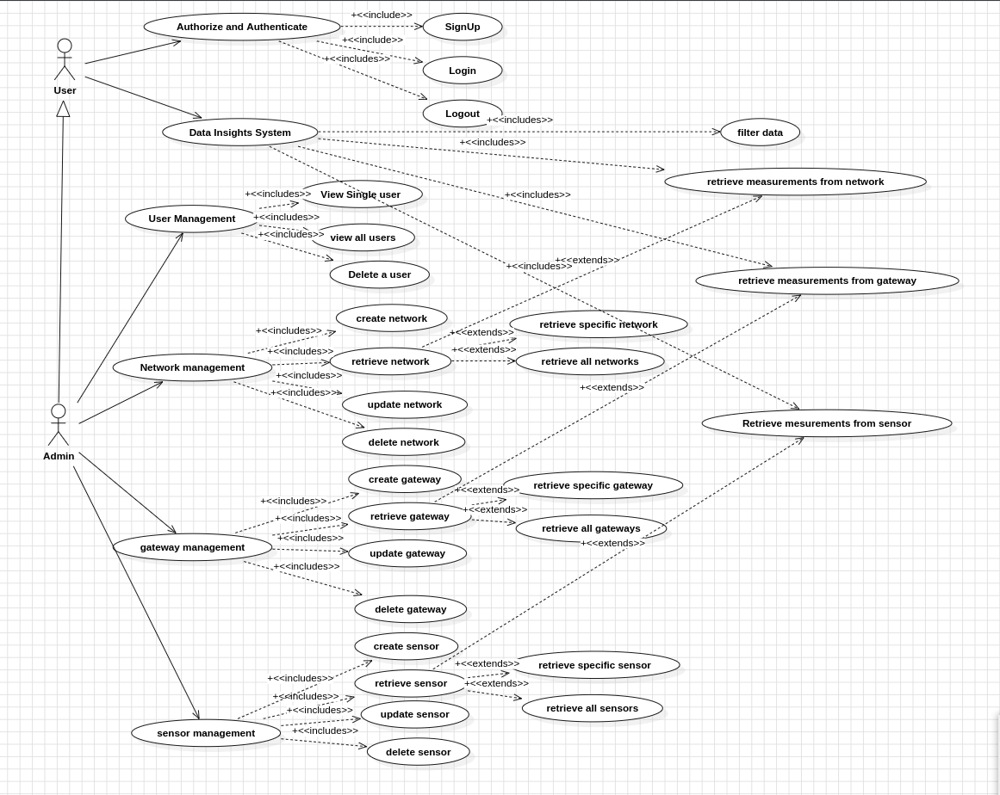
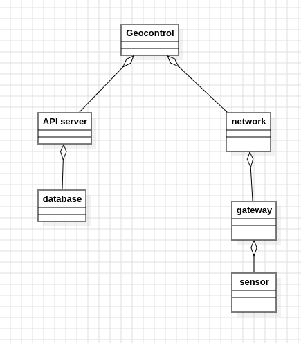
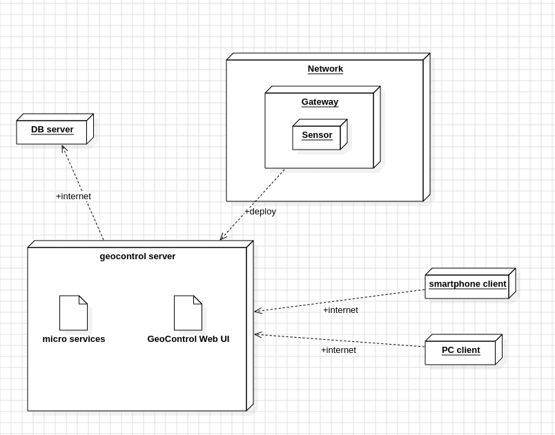
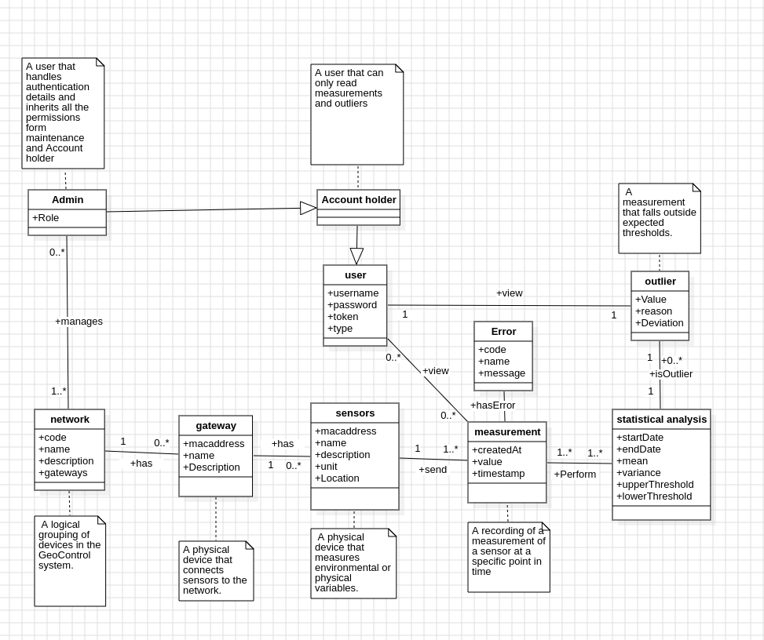

# Requirements Document - GeoControl

Date:

Version: V1 - description of Geocontrol as described in the swagger

| Version number | Change |
| :------------: | :----: |
|                |        |

# Contents

- [Requirements Document - GeoControl](#requirements-document---geocontrol)
- [Contents](#contents)
- [Informal description](#informal-description)
- [Business model](#business-model)
- [Stakeholders](#stakeholders)
- [Context Diagram and interfaces](#context-diagram-and-interfaces)
  - [Context Diagram](#context-diagram)
  - [Interfaces](#interfaces)
- [Stories and personas](#stories-and-personas)
- [Functional and non functional requirements](#functional-and-non-functional-requirements)
  - [Functional Requirements](#functional-requirements)
  - [Non Functional Requirements](#non-functional-requirements)
- [Use case diagram and use cases](#use-case-diagram-and-use-cases)
  - [Use case diagram](#use-case-diagram)
    - [Use case 1, UC1](#use-case-1-uc1)
      - [Scenario 1.1](#scenario-11)
      - [Scenario 1.2](#scenario-12)
      - [Scenario 1.x](#scenario-1x)
    - [Use case 2, UC2](#use-case-2-uc2)
    - [Use case x, UCx](#use-case-x-ucx)
- [Glossary](#glossary)
- [System Design](#system-design)
- [Deployment Diagram](#deployment-diagram)

# Informal description

## Overview
GeoControl is an advanced monitoring and automation system designed to track environmental and structural parameters in various spaces, including historical buildings, residential homes, offices, and geological sites. The system consists of sensor units, a central processing platform, and user interfaces for real-time monitoring, analysis, and automated control.

## How It Works
GeoControl deploys smart sensors across different environments to collect real-time data on temperature, humidity, lighting, air quality, soil moisture, groundwater flow, and structural vibrations. This data is transmitted to the GeoControl Cloud Platform, where it is analyzed for anomalies, trends, and potential risks.

## Use Cases

### For Conservation Experts & Historical Building Surveillance
- Enables detailed structural monitoring of historical sites, detecting early signs of foundation shifts, excessive moisture, or air pollution exposure
- Provides access to long-term analytics to predict degradation and plan conservation efforts
- Sends emergency alerts to prevent irreversible damage to heritage sites

### For Homeowners & Office Managers
- Ensures optimal indoor conditions by continuously tracking temperature, air quality, and lighting
- Offers smart automation allowing users to configure energy-efficient settings, reducing waste while improving comfort
- Integrates with smart home devices for seamless control over HVAC, lighting, and ventilation

### For Emergency Response Teams
- Detects critical conditions such as structural shifts, fire hazards, gas leaks, or high CO2 levels
- Triggers automated alerts to emergency teams, providing real-time environmental data for faster response
- Stores historical data logs to help authorities analyze past events and improve future risk mitigation

### For Geologists & Scientists (Hydrogeological Analysis)
- Assists geologists in monitoring groundwater levels, soil moisture, and geological stability
- Tracks water flow patterns, aiding in flood prediction and landslide risk assessments
- Provides high-resolution geological data to study long-term climate and environmental changes
- Supports AI-driven trend analysis to predict water shortages, erosion risks, and aquifer health

## System Components

1. **Sensor Network** – IoT sensors placed across environments to capture physical and environmental parameters
2. **GeoControl Web Platform** – The system's intelligence, responsible for data processing, anomaly detection, and automated actions
3. **User Interfaces** – Web and mobile applications allow users to visualize real-time data, receive alerts, and manage automation settings
4. **Automation & Alerts** – If conditions exceed predefined thresholds, the system can send alerts via email, SMS, or app notifications and trigger automated responses

## Fail-Safe Mechanism
In case of sensor failure or communication loss, GeoControl stores critical last-known values and attempts self-recovery. IT administrators, facility managers, and emergency teams receive instant notifications to ensure system continuity.

# Business Model

## Who? (Customer Segments)
- **Home Segment**: Homeowners and Building Automation companies to deploy IoT's
- **Historical Buildings**: Conservation Experts, Civil Engineers, Government Agencies
- **Hydrogeological Analysis**: Geologists, Scientists, Government Agencies, Emergency threat teams

## Why? (Value Proposition)
Heritage preservation, smart living & workspaces, disaster prevention, hydrogeological insights, real-time monitoring, AI-driven analysis, automation, safety, efficiency, sustainability.

## Money Flow? (Revenue Stream)
Organizations and Government offices buy the software and make it available for free for the users.

| Key Partners | Key Activities | Value Propositions | Customer Relationships | Customer Segments |
|--------------|----------------|---------------------|-------------------------|--------------------|
| - IoT sensor manufacturers   - Engineering consultancies   - Universities & researchers    - Compliance bodies  - Emergency response team    | - Software development   - Sensor integration   - Real-time data processing   - Reporting & visualization   - Client support & onboarding   -Plug-and-play sensor   -Alert system   | - Unified monitoring system   - Real-time alerts & analytics   - Historical data & trends   - Safety   - Efficiency   - Sustainability   - Heritage preservation   - Smart work spaces |   - Customization services | - Public sector agencies   - Engineering & construction firms   - Heritage preservation institutions   - Smart building managers   - Scientists & researchers in archeology|

| Key Resources | Channels | Cost Structure | Revenue Streams |
|---------------|----------|----------------|------------------|
| - Development team   - Cloud infrastructure   - IoT specialists    - Sales & marketing team | - Direct sales(SaaS)   - Company website   - Web-based platforms (cloud-hosted web app)    | - Dev & engineering salaries   - Cloud infrastructure   - Sensor costs   - Maintenance staff salaries   - Marketing & ads | - Avaliable for Free |

# Stakeholders

| Stakeholder name                     | Description                                                                 |
| :----------------------------------: | :--------------------------------------------------------------------------: |
| Scientists/Geologists                | Experts who study the Earth's processes and materials to assess environmental changes. |
| Conservation Experts/Civil Engineers| Professionals focused on sustainable design, infrastructure, and preservation. |
| HomeOwners and Office Supervisors   | Individuals responsible for building management, safety, and maintenance.   |
| Government Agencies                 | Public authorities involved in policy-making, regulation, and safety enforcement. |
| Emergency Response Teams            | Teams responsible for reacting to natural disasters and emergencies.        |
| Investors                           | Stakeholders who fund projects and expect returns on their investments.     |
| Sensor Manufacturers and Supply Teams| Entities involved in producing and delivering sensor hardware.             |
| Building Automation Companies       | Companies that design and implement smart control systems for buildings.    |

# Context Diagram and interfaces

## Context Diagram

## Interfaces

| Actor         | Logical Interface         | Physical Interface                                        |
| :-----------: | :-----------------------: | :-------------------------------------------------------: |
| End Users (Homeowners, Office Managers, Facility Managers, Government Agencies, Conservation Experts, Civil Engineers) | PC or Mobile Device        | Web Application                                            |
| Environmental Sensors | IoT Devices (IR sensors, vibration sensors, air quality sensors) | Electrical signals with data information to GeoControl API |
| Admin          | PC or Mobile Device        | Web Application or Android/iOS App                       |
| Gateway        | Internet Connection         | Cloud API, Serial Connection                             |

# Stories and personas

### Persona: Alex – System Administrator & Field Technician  
**Is-an-instance-of:** Admin, Gateway Operator

**Who Alex is:**  
Alex is employed by a regional archaeological organization responsible for monitoring excavation sites and heritage zones using IoT-enabled environmental sensors. He wears multiple hats — managing user access remotely and maintaining the deployed sensor network on-site. His dual role helps ensure the security, accuracy, and operational continuity of the GeoControl system in both office and field contexts.

**What Alex focuses on:**  
- Defining and managing user access privileges in the GeoControl system for researchers, interns, and technicians.  
- Structuring sensor networks to reflect the physical layout of archaeological sites.  
- Adding, configuring, and maintaining sensors and gateways installed at dig sites or heritage zones.  
- Ensuring reliable data capture, particularly in remote or historically sensitive locations.  
- Using sensor data and outlier reports to detect anomalies like unusual moisture, vibrations, or temperature changes that may indicate risks to artifacts or structures.

**User Goals:**  
- “I need to manage user accounts securely, so only authorized individuals access the data.”  
- “I want the sensor network to mirror the actual site structure for easier monitoring and troubleshooting.”  
- “I need to deploy and configure new sensors quickly to start data collection at new excavation areas.”  
- “I want to update gateway or sensor records when hardware is moved or replaced.”  
- “I must input and verify measurement data collected during field inspections to maintain data accuracy.”

---

### Persona: Elias – Urban Data Analyst (Viewer Role)  
**Is-an-instance-of:** End User

**Who Elias is:**  
Elias is a consultant who works with urban development teams. He uses environmental data to evaluate project viability and public safety measures.

**What Elias focuses on:**  
- Viewing up-to-date and historical environmental data.  
- Interpreting statistical reports and spotting abnormal values.  
- Using insights to guide policy or infrastructure decisions.

**User Goals:**  
- “I want to access detailed data and anomalies to inform planning decisions.”  
- “I need to export data summaries and reports for documentation and further analysis.”

# Functional and non functional requirements

## Functional Requirements

|  ID   | Description |
| :---: | :---------- |
|  FR1  | Authorization and authentication, account management |
|  1.1  | Sign up (create account and password) |
|  1.2  | Log in |
| 1.2.1 | Generate MFA access tokens |
|  1.3  | Log out |
|  1.4  | Change password |
|  1.5  | Delete account |
|  FR2  | Monitor usage |
|  2.1  | Change user role |
|  2.2  | Logs of all activity (log in logout, types of accesses) of each user |
|  FR4  | Data Collection And Analysis |
|  4.1  | Data retrieval from sensors |
|  4.2  | Normalization and Parsing of data |
|  4.3  | Data Filter based on sensor ids and dates |
|  4.4  | Store Data in Database |
|  4.5  | Perform Statistical Analysis |
| 4.5.1 | Calculate Threshold (based on min, max values) |
| 4.5.3 | Calculate mean |
| 4.5.4 | Calculate variance |
| 4.5.5 | Calculate outliers and anomaly values |
|  4.6  | Generate alerts based on outliers |
|  FR5  | Maintenance |
|  5.1  | Diagnose system |
|  5.2  | Upload new firmwares |

## Non Functional Requirements

|   ID  | Type | Description | Refers to |
| :---: | :--: | :---------- | :-------: |
| NFR1  | Usability | First usage: have user create account and start using in < 5 minutes | 1.1 |
| NFR1  | Usability | First usage after mapping: have user logged in < 1 minute | |
| NFR1  | Usability | Size of App to download <1000Mb | |
| NFR1  | Usability | The System must support multiple languages | |
| NFR2  | Efficiency | The system must handle upto 10000 simultaneous measurements at a time | |
| NFR2  | Efficiency | Response time for all functions<3 Sec | |
| NFR3  | Reliability | Data should have a backup option | |
| NFR3  | Reliability | Min data loss should occur(no more than 10 measurements are lost per year) | |
| NFR3  | Reliability | Disaster recovery planning(RTO should be 24 hrs) | |
| NFR3  | Reliability | Work for at least 10000 hrs before any sensor component fails | |
| NFR4  | Portability | App should be available both on android and IOS devices and also on web browsers on PC's and laptops | |
| NFR5  | Maintainability | Regularly patch and update the software without any service interruption | |
| NFR5  | Maintainability | Maintain and regularly update your technical documentation | |
| NFR6  | Security | No un-authorized person should be able to login | |
| NFR6  | Security | Should use https for reliable api communication | |
| NFR6  | Security | Use MFA for login | |
| NFR6  | Security | Data Privacy: User data should be private and encrypted | |
| NFR6  | Security | Compliance with GDPR regulations | |

## Table of Rights

|      | End user | Admin | Sensors | Network |
|------|----------|--------|----------|----------|
| FR1  | Y        | Y      | N        | N        |
| FR2  | N        | Y      | N        | N        |
| FR3  | N        | Y      | Y        | Y        |
| FR4  | Y        | Y      | N        | N        |
| FR5  | N        | Y      | N        | N        |

# Use case diagram and use cases

## Use case diagram

### Use case 1: Create User

| Actors Involved  | User, Admin                                                 |
| :--------------: | :------------------------------------------------------------------: |
|   Precondition   | User does not have an account|
|  Post condition  | User account is created|
| Nominal Scenario | User creates account using new username and password  |
|     Variants     | |
|    Exceptions    | invalid data entry. Username already taken.Password not meeting requirements, The server is not reachable. |

##### Scenario 1.1
|  Scenario 1.1  |                                                                            |
| :------------: | :------------------------------------------------------------------------: |
|   Precondition   | User has already an account                                              |
|  Post condition  | User is autheticated                                                     |
|       1        | User inserts username |
|       2        | Server checks if username is unique |
|       3        | User inserts password |
|       4        | Sever checks if passoword is a  valid entry |
|       5        | Sever creates new entry |
|       6        | Sever sends message of success |

### Use case 2: Login

| Actors Involved  | User, Admin                                                                                   |
| :--------------: | :--------------------------------------------------------------------------------------------: |
|   Precondition   | User already has an account                                                                    |
|  Post condition  | User is authenticated and can access other functionalities based on their role                |
| Nominal Scenario | User enters username and password and receives an access token                                 |
|     Variants     | None                                                                                           |
|    Exceptions    | The user object contains invalid data. Username or password is incorrect. The server is not reachable. |

##### Scenario 2.1

|    Scenario 2.1   |                                                                          |
| :---------------: | :----------------------------------------------------------------------: |
|   Precondition    | User already has an account                                              |
|  Post condition   | User is authenticated                                                    |
|        1          | User enters username                                                     |
|        2          | User enters password                                                     |
|        3          | Server validates the username and password                               |
|        4          | Server issues an access token                                            |

---

### Use case 3: Logout

| Actors Involved  | User, Admin                                                        |
| :--------------: | :------------------------------------------------------------------: |
|   Precondition   | User is already authenticated |
|  Post condition  | User is logged out |
| Nominal Scenario | User's token is invalidated and access to functionalities is revoked |
|     Variants     |  |
|    Exceptions    |  |

---

### Use case 4: View all users

| Actors Involved  | Admin |
| :--------------: | :------------------------------------------------------------------: |
|   Precondition   | Admin is authenticated |
|  Post condition  | The list of all users is displayed |
| Nominal Scenario | Admin can view all users and their information |
|     Variants     | No variants |
|    Exceptions    | The request is made by a user with insufficient rights. The request is made without a valid token. The server is not reachable. |

##### Scenario 4.1

|    Scenario 4.1   |                                                                          |
| :---------------: | :----------------------------------------------------------------------: |
|   Precondition    | Admin is authenticated                                                   |
|  Post condition   | Admin can see all users                                                  |
|        1          | Admin requests to see users                                              |
|        2          | Server checks permissions                                                |
|        3          | Server sends the list of users and returns a success status code         |

### Use case 5, View single user

| Actors Involved  | Admin                                                                |
| :--------------: | :------------------------------------------------------------------: |
|   Precondition   | Admin is authenticated                                               |
|  Post condition  | The data of a single user are displayed                                        |
| Nominal Scenario | Admin can see informations of a users                        |
|     Variants     | No variants |
|    Exceptions    | The request is performed by a user with insufficient rights. The request is performed by a user without a valid token. The server is not reachable. The id of the requested user is not found |

##### Scenario 5.1
|  Scenario 5.1  |                                                                            |
| :------------: | :------------------------------------------------------------------------: |
|   Precondition   | Admin is authenticated                                              |
|  Post condition  | informations of the requested user are displayed                                                      |
|       1        | Admin request to see a user                             |
|       2        | Servers checks permission                             |
|       3        | Servers checks if user exists                              |
|       4        | Server sends user's informations and success status code |

### Use case 6, Delete a user

| Actors Involved  | Admin                                                     |
| :--------------: | :------------------------------------------------------------------: |
|   Precondition   | Admin is authenticated                       |
|  Post condition  | A user is deleted |
| Nominal Scenario | Admin inserts a username and the corrisponding user is removed |
|     Variants     | |
|    Exceptions    | The request is performed by a user with insufficient rights. The request is performed by a user without a valid token. The server is not reachable. Inserted username doesn't exist |

##### Scenario 6.1

|    Scenario 6.1   |                                                                          |
| :---------------: | :----------------------------------------------------------------------: |
|   Precondition    | Admin is authenticated                                                   |
|  Post condition   | A specific user is removed from the system                               |
|        1          | Admin initiates a request to delete a user by entering the username      |
|        2          | Server verifies admin’s permissions and validates the provided username  |
|        3          | If the user exists, the server deletes the user and returns confirmation |

### Use Case 7: Create Network

| Actors Involved  | Admin |
| :--------------: | :----------------: |
|   Precondition   | User is authenticated as admin   |
|  Post condition  | New network is created |
| Nominal Scenario | User enters network details. System validates input and uniqueness, then confirms creation |
|     Variants     | None |
|    Exceptions    | Insufficient rights, invalid parameters, duplicate ID, server unavailable |

#### Scenario 7.1

| Scenario 7.1    |                                                                      |
| :--------------: | :------------------------------------------------------------------: |
|   Precondition   | User is authenticated as admin                             |
|  Post condition  | Network created successfully                                          |
|        1         | User enters network details                                           |
|        2         | System validates parameters and checks ID uniqueness                  |
|        3         | System confirms network creation (HTTP 201)                           |

---

### Use Case 8: Create Gateway

| Actors Involved  | Admin  |
| :--------------: | :----------------: |
|   Precondition   | User is authenticated as admin|
|  Post condition  | New gateway is created |
| Nominal Scenario | User inputs network and gateway details. System validates and checks MAC address uniqueness |
|     Variants     | None |
|    Exceptions    | Insufficient rights, invalid parameters, duplicate MAC, server unavailable |

#### Scenario 8.1

| Scenario 8.1    |                                                                      |
| :--------------: | :------------------------------------------------------------------: |
|   Precondition   | User is authenticated as admin                           |
|  Post condition  | Gateway created successfully                                          |
|        1         | User enters network and gateway details                               |
|        2         | System checks network existence, validates parameters and MAC uniqueness |
|        3         | System confirms gateway creation (HTTP 201)                          |

---

### Use Case 9: Create Sensor

| Actors Involved  | Admin |
| :--------------: | :----------------: |
|   Precondition   | User is authenticated as admin   |
|  Post condition  | New sensor is created |
| Nominal Scenario | User enters network, gateway, and sensor details. System validates input and checks MAC uniqueness |
|     Variants     | None |
|    Exceptions    | Insufficient rights, invalid parameters, duplicate MAC, server unavailable |

#### Scenario 9.1

|  Scenario 9.1  |                                                                            |
| :------------: | :------------------------------------------------------------------------: |
|  Precondition  | Admin     authenticated  |
| Post condition | The new Sensor has been created |
| 1              | The user inputs NetworkCode and GatewayMac to which the Sensor should be attached |
| 2              | The user inputs Sensor MAC address, name, description |
| 3              | The syetem checks NetworkCode and GatewayMAC exist, OK |
| 4              | The system checks that the Sensor parameters are valid, OK |
| 5              | The system checks that the Sensor MAC address is not already in use, OK |
| 6              | The system sends confirmation (HTTP 201) |

### Use Case 10: Update Network

| Actors Involved  | Admin   |
| :--------------: | :----------------: |
|   Precondition   | User authenticated as admin  |
|  Post condition  | Network with NetworkCode updated |
| Nominal Scenario | User updates network details |
|     Variants     | None |
|    Exceptions    | Insufficient rights, invalid parameters, network not found, duplicate NetworkCode, server error |

#### Scenario 10.1

| Scenario 10.1    |                                                                     |
| :--------------:  | :------------------------------------------------------------------: |
|   Precondition    | Admin     authenticated                                      |
|  Post condition   | Network with NetworkCode updated                                     |
|        1          | User inputs NetworkCode to be updated                               |
|        2          | User enters updated parameters                                       |
|        3          | System verifies network exists, OK                                   |
|        4          | System checks new NetworkCode is not in use, OK                      |
|        5          | System validates updated parameters                                  |
|        6          | System updates the network                                           |
|        7          | System updates attached Gateways                                     |
|        8          | System confirms update (HTTP 204)                                    |

---

### Use Case 11: Update Gateway

| Actors Involved  | Admin    |
| :--------------: | :----------------: |
|   Precondition   | User authenticated as admin  |
|  Post condition  | Gateway updated |
| Nominal Scenario | User updates gateway details |
|     Variants     | None |
|    Exceptions    | Insufficient rights, invalid parameters, gateway or network not found, duplicate MAC, server error |

#### Scenario 11.1

| Scenario 11.1    |                                                                     |
| :--------------:  | :------------------------------------------------------------------: |
|   Precondition    | Admin     authenticated                                      |
|  Post condition   | Gateway with MAC GatewayMAC updated                                  |
|        1          | User inputs NetworkCode and GatewayMAC of gateway to be updated     |
|        2          | User enters updated gateway details                                  |
|        3          | System checks network and gateway existence, OK                     |
|        4          | System verifies new MAC is not in use, OK                            |
|        5          | System validates gateway parameters                                  |
|        6          | System updates gateway                                               |
|        7          | System updates attached Sensors                                      |
|        8          | System confirms update (HTTP 204)                                    |

---

### Use Case 12: Update Sensor

| Actors Involved  | Admin   |
| :--------------: | :----------------: |
|   Precondition   | User authenticated as admin  |
|  Post condition  | Sensor updated |
| Nominal Scenario | User updates sensor details |
|     Variants     | None |
|    Exceptions    | Insufficient rights, invalid parameters, sensor or gateway not found, duplicate MAC, server error |

#### Scenario 12.1

| Scenario 12.1    |                                                                     |
| :--------------:  | :------------------------------------------------------------------: |
|   Precondition    | Admin     authenticated                                      |
|  Post condition   | Sensor with MAC SensorMAC updated                                    |
|        1          | User inputs NetworkCode, GatewayMAC, and SensorMAC to be updated     |
|        2          | User enters updated sensor details                                   |
|        3          | System checks sensor's network and gateway, OK                       |
|        4          | System verifies new MAC is not in use, OK                            |
|        5          | System validates sensor parameters                                   |
|        6          | System updates sensor                                                |
|        7          | System updates attached measurements                                |
|        8          | System confirms update (HTTP 204)                                    |

---

### Use Case 13: Delete Network

| Actors Involved  | Admin   |
| :--------------: | :----------------: |
|   Precondition   | User authenticated as admin  |
|  Post condition  | Network deleted |
| Nominal Scenario | Network's information deleted |
|     Variants     | None |
|    Exceptions    | Insufficient rights, network not found, server error |

#### Scenario 13.1

| Scenario 13.1    |                                                                     |
| :--------------:  | :------------------------------------------------------------------: |
|   Precondition    | Admin     authenticated                                      |
|  Post condition   | Network deleted                                                     |
|        1          | User inputs NetworkCode to be deleted                                |
|        2          | System checks network existence, OK                                 |
|        3          | System deletes the network                                           |
|        4          | System confirms deletion (HTTP 204)                                  |

---

### Use Case 14: Delete Gateway

| Actors Involved  | Admin   |
| :--------------: | :----------------: |
|   Precondition   | User authenticated as admin  |
|  Post condition  | Gateway deleted |
| Nominal Scenario | Gateway's information deleted |
|     Variants     | None |
|    Exceptions    | Insufficient rights, gateway or network not found, server error |

#### Scenario 14.1

| Scenario 14.1    |                                                                     |
| :--------------:  | :------------------------------------------------------------------: |
|   Precondition    | Admin     authenticated                                      |
|  Post condition   | Gateway deleted                                                     |
|        1          | User inputs `NetworkCode` and `GatewayMAC` of the gateway to be deleted  |
|        2          | System checks network and gateway existence, OK                     |
|        3          | System deletes the gateway                                           |
|        4          | System confirms deletion (HTTP 204)                                  |

---

### Use Case 15: Delete Sensor

| Actors Involved  | Admin    |
| :--------------: | :----------------: |
|   Precondition   | User authenticated as admin  |
|  Post condition  | Sensor deleted |
| Nominal Scenario | Sensor's information deleted |
|     Variants     | None |
|    Exceptions    | Insufficient rights, sensor or gateway not found, server error |

#### Scenario 15.1

| Scenario 15.1    |                                                                     |
| :--------------:  | :------------------------------------------------------------------: |
|   Precondition    | Admin     authenticated                                      |
|  Post condition   | Sensor deleted                                                     |
|        1          | User inputs NetworkCode, GatewayMAC, and SensorMAC of the sensor to be deleted |
|        2          | System checks network, gateway, and sensor existence, OK            |
|        3          | System deletes the sensor                                            |
|        4          | System confirms deletion (HTTP 204)                                  |

### Use Case 16: Create Measurement

| Actors Involved  | Admin                                     |
| :--------------: | :------------------------------------------------: |
|   Precondition   | The user is authenticated as an admin or   |
|  Post condition  | The measurement is successfully created            |
| Nominal Scenario | The system adds the measurement information        |
|     Variants     | None                                               |
|    Exceptions    | - Insufficient rights for the user.   - Invalid token for the user.   - The sensor's network does not exist.   - The sensor's gateway does not exist.   - The sensor does not exist.   - Invalid input parameters.   - Internal server error. |

#### Scenario 16.1

|  Scenario 16.1  |                                                                            |
| :------------: | :------------------------------------------------------------------------: |
|  Precondition  | The user is authenticated as an Admin      |
| Post condition | The measurement is successfully created               |
| 1              | The user provides the sensor’s `networkCode`, `gatewayMAC`, and `sensorMAC` of the sensor that performed the measurement. |
| 2              | The user provides the `creationTimestamp` (in the sensor's local timezone) and measurement `value`. |
| 3              | The system checks the existence of `networkCode`, `gatewayMAC`, and `sensorMAC`, confirming they are valid. |
| 4              | The system validates the measurement parameters and confirms their validity. |
| 5              | The system converts the timestamp to ISO8601 format (FR 4.4.1). |
| 6              | The system stores the measurement data. |
| 7              | The system sends a confirmation response with HTTP status 201 (Created). |

---

## Use Case 17: View and Filter Measurement Data

| **Actors Involved** | User , Admin |
|---------------------|------|
| **Precondition**    | The user is authenticated |
| **Post condition**  | Filtered measurement data is displayed based on the user’s selected criteria |
| **Nominal Scenario**| The user views sensor measurements and applies filters such as time range, sensor type, or specific location |
| **Variants**        | The user can apply multiple filters like date, value range, or sensor status |
| **Exceptions**      | - Invalid or expired user token   - No data available for the selected filters   - Internal server error |

### Scenario 17.1

| **Scenario 17.1**   |                                                                 |
|---------------------|-----------------------------------------------------------------|
| **Precondition**    | The user is authenticated |
| **Post condition**  | Filtered measurement data is returned and displayed |
| **1**               | The user navigates to the measurement data dashboard |
| **2**               | The user selects filters such as `networkCode`, `gatewayMAC`, `sensorMAC`, time range, and/or value range |
| **3**               | The system validates the filter parameters |
| **4**               | The system queries the database for measurements that match the filters |
| **5**               | The system returns and displays the filtered results (HTTP 200) |

### Use Case 18: Retrieve Measurements from a Network

| Actors Involved  | User , Admin                                           |
| :--------------: | :------------------------------------------------: |
|   Precondition   | The user is authenticated                            |
|  Post condition  | The measurements from an entire network are retrieved |
| Nominal Scenario | Aggregated network measurement information is displayed |
|     Variants     | - Retrieve Stats (individual measurements are omitted).   - Retrieve Outliers (only outlier measurements are returned). |
|    Exceptions    | - The request is made by a user without a valid token.   - Internal server error.   - The network does not exist. |

#### Scenario 18.1

|  Scenario 18.1  |                                                                            |
| :------------: | :------------------------------------------------------------------------: |
|  Precondition  | The user is authenticated. |
| Post condition | Measurements from the specified network are retrieved. |
| 1              | The user provides the `networkCode` and optional filters (e.g., `dateStart`, `dateEnd`, `sensorMACs`). |
| 2              | The system checks that the `networkCode` exists. |
| 3              | The system retrieves all measurements from sensors within the specified network. |
| 4              | The system applies the provided filters to the measurements. |
| 5              | The system computes mean, variance, upper threshold, and lower threshold for the data. |
| 6              | The system checks if any measurements are outliers based on the thresholds. |
| 7              | The system sends the retrieved measurement data. |

---

### Use Case 19: Retrieve Measurements from a Sensor

| Actors Involved  | User, Admin                                                 |
| :--------------: | :------------------------------------------------: |
|   Precondition   | The user is authenticated                            |
|  Post condition  | The measurements from a specific sensor are retrieved |
| Nominal Scenario | Aggregated sensor measurement information is displayed |
|     Variants     | - Retrieve Stats (individual measurements are omitted).   - Retrieve Outliers (only outlier measurements are returned). |
|    Exceptions    | - The request is made by a user without a valid token.   - Internal server error.   - The network, gateway, or sensor does not exist. |

#### Scenario 19.1

|  Scenario 19.1  |                                                                            |
| :------------: | :------------------------------------------------------------------------: |
|  Precondition  | The user is authenticated. |
| Post condition | Measurements from the specified sensor are retrieved. |
| 1              | The user provides the `networkCode`, `gatewayMAC`, `sensorMAC` and optional filters (e.g., `dateStart`, `dateEnd`, `sensorMACs`). |
| 2              | The system checks that `networkCode`, `gatewayMAC`, and `sensorMAC` exist. |
| 3              | The system retrieves all measurements from the specified sensor. |
| 4              | The system applies the provided filters to the measurements. |
| 5              | The system computes mean, variance, upper threshold, and lower threshold for the data. |
| 6              | The system checks if any measurements are outliers based on the thresholds. |
| 7              | The system sends the retrieved measurement data. |

### Use Case 20: Retrieve All Networks

| Actors Involved  | User, Admin                                                 |
| :--------------: | :------------------------------------------------: |
|   Precondition   | The user is authenticated                            |
|  Post condition  | All networks are successfully retrieved              |
| Nominal Scenario | Information about all networks is displayed          |
|     Variants     | None                                                 |
|    Exceptions    | - The request is made by a user without a valid token.   - Internal server error. |

#### Scenario 20.1

|  Scenario 20.1  |                                                                            |
| :------------: | :------------------------------------------------------------------------: |
|  Precondition  | The user is authenticated.                                      |
| Post condition | All networks and associated data are successfully retrieved. |
| 1              | The user requests all networks. |
| 2              | The system retrieves information about all networks, gateways attached to each network, and sensors connected to each gateway. |
| 3              | The system sends the list of networks along with a success response (HTTP 200). |

---

### Use Case 21: Retrieve a Specific Network

| Actors Involved  | User, Admin                                                 |
| :--------------: | :------------------------------------------------: |
|   Precondition   | The user is authenticated                            |
|  Post condition  | The specific network is successfully retrieved       |
| Nominal Scenario | Information about a specific network is displayed     |
|     Variants     | None                                                 |
|    Exceptions    | - The request is made by a user without a valid token.   - Internal server error.   - The network does not exist. |

#### Scenario 21.1

|  Scenario 18.1  |                                                                            |
| :------------: | :------------------------------------------------------------------------: |
|  Precondition  | The user is authenticated. |
| Post condition | The specific network is successfully retrieved. |
| 1              | The user requests information for a network using its `networkCode`. |
| 2              | The system verifies that the `networkCode` exists. |
| 3              | The system retrieves the network information, including all gateways attached to the network and sensors connected to each gateway. |
| 4              | The system sends the retrieved information with a success response (HTTP 200). |

---

### Use Case 22: Retrieve All Gateways

| Actors Involved  | User, Admin                                                 |
| :--------------: | :------------------------------------------------: |
|   Precondition   | The user is authenticated                            |
|  Post condition  | All gateways associated with the network are retrieved |
| Nominal Scenario | Information about all gateways in a network is displayed |
|     Variants     | None                                                 |
|    Exceptions    | - The request is made by a user without a valid token.   - Internal server error.   - The network does not exist. |

#### Scenario 22.1

|  Scenario 19.1  |                                                                            |
| :------------: | :------------------------------------------------------------------------: |
|  Precondition  | The user is authenticated. |
| Post condition | All gateways associated with the network are successfully retrieved. |
| 1              | The user requests all gateways in a specific network. |
| 2              | The system checks that the `networkCode` exists. |
| 3              | The system retrieves all gateways associated with the network, as well as all sensors connected to each gateway. |
| 4              | The system sends the retrieved information with a success response (HTTP 200). |

---

### Use Case 23: Retrieve a Specific Gateway

| Actors Involved  | User, Admin                                                 |
| :--------------: | :------------------------------------------------: |
|   Precondition   | The user is authenticated                            |
|  Post condition  | The specific gateway is successfully retrieved       |
| Nominal Scenario | Information about a specific gateway is displayed    |
|     Variants     | None                                                 |
|    Exceptions    | - The request is made by a user without a valid token.   - Internal server error.   - The network or gateway does not exist. |

#### Scenario 23.1

|  Scenario 20.1  |                                                                            |
| :------------: | :------------------------------------------------------------------------: |
|  Precondition  | The user is authenticated. |
| Post condition | The specific gateway is successfully retrieved. |
| 1              | The user requests a specific gateway in a particular network. |
| 2              | The system checks that both `networkCode` and `gatewayMAC` exist. |
| 3              | The system retrieves the gateway’s information, including all sensors attached to the gateway. |
| 4              | The system sends the retrieved information with a success response (HTTP 200). |

---

### Use Case 24: Retrieve All Sensors

| Actors Involved  | User, Admin                                                 |
| :--------------: | :------------------------------------------------: |
|   Precondition   | The user is authenticated                            |
|  Post condition  | All sensors associated with the gateway are retrieved |
| Nominal Scenario | Information about all sensors connected to the gateway is displayed |
|     Variants     | None                                                 |
|    Exceptions    | - The request is made by a user without a valid token.   - Internal server error.   - The network or gateway does not exist. |

#### Scenario 24.1

|  Scenario 21.1  |                                                                            |
| :------------: | :------------------------------------------------------------------------: |
|  Precondition  | The user is authenticated. |
| Post condition | All sensors connected to the specified gateway are successfully retrieved. |
| 1              | The user requests all sensors connected to a specific gateway. |
| 2              | The system checks that the `networkCode` and `gatewayMAC` exist. |
| 3              | The system retrieves all sensors attached to the specified gateway. |
| 4              | The system sends the retrieved list of sensors with a success response (HTTP 200). |

---

### Use Case 25: Retrieve a Specific Sensor

| Actors Involved  | User, Admin                                                 |
| :--------------: | :------------------------------------------------: |
|   Precondition   | The user is authenticated                            |
|  Post condition  | The specific sensor is successfully retrieved        |
| Nominal Scenario | Information about a specific sensor is displayed      |
|     Variants     | None                                                 |
|    Exceptions    | - The request is made by a user without a valid token.   - Internal server error.   - The network, gateway, or sensor does not exist. |

#### Scenario 25.1

|  Scenario 22.1  |                                                                            |
| :------------: | :------------------------------------------------------------------------: |
|  Precondition  | The user is authenticated. |
| Post condition | The specific sensor is successfully retrieved. |
| 1              | The user requests a specific sensor attached to a specific gateway in a given network. |
| 2              | The system checks that the `networkCode`, `gatewayMAC`, and `sensorMAC` exist. |
| 3              | The system retrieves the sensor’s information. |
| 4              | The system sends the retrieved information with a success response (HTTP 200). |

---

# Glossary

## Key Concepts

- **End User**: Person or organization who intends to use Geo Control through web or mobile interfaces
- **Environmental Sensors**: Network of IoT devices that measures physical and environmental parameters
- **Admin**: System administrator with permissions on Gro Control platform
- **Gateway**: Virtual connection that bridges communication between the local sensor network and the cloud platform

# System Design

# Deployment Diagram

# Class Diagram

