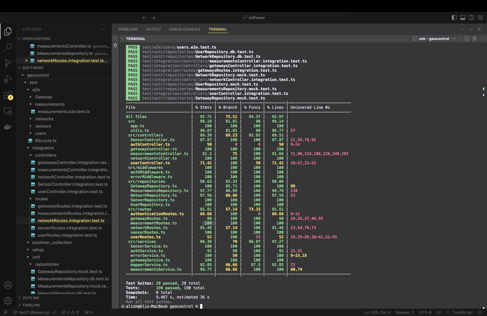

# Test Report

The goal of this document is to explain how the application was tested, detailing how the test cases were defined and what they cover.

# Contents

- [Test Report](#test-report)  
- [Contents](#contents)  
- [Dependency graph](#dependency-graph)  
- [Integration approach](#integration-approach)  
- [Tests](#tests)  
- [Coverage](#coverage)  
  - [Coverage of FR](#coverage-of-fr)  
  - [Coverage white box](#coverage-white-box)

# Dependency graph

The application is structured as follows:

```
app.ts
 ├─ src/routes/
 │    ├─ authenticationRoutes.ts
 │    ├─ gatewayRoutes.ts
 │    ├─ measurementRoutes.ts
 │    ├─ networkRoutes.ts
 │    ├─ sensorRoutes.ts
 │    └─ userRoutes.ts
 ├─ src/controllers/
 │    ├─ AuthController.ts
 │    ├─ GatewayController.ts
 │    ├─ MeasurementsController.ts
 │    ├─ NetworkController.ts
 │    ├─ SensorController.ts
 │    └─ UserController.ts
 ├─ src/services/
 │    ├─ authService.ts
 │    ├─ gatewayService.ts
 │    ├─ measurementsService.ts
 │    ├─ mapperService.ts
 │    ├─ errorService.ts
 │    └─ SensorService.ts
 ├─ src/repositories/
 │    ├─ UserRepository.ts
 │    ├─ GatewayRepository.ts
 │    ├─ MeasurementsRepository.ts
 │    ├─ NetworkRepository.ts
 │    └─ SensorRepository.ts
 ├─ src/middlewares/
 │    ├─ authMiddleware.ts
 │    └─ errorMiddleware.ts
 └─ src/utils.ts
```

# Integration approach

We adopted a **mixed (bottom-up then top-down)** strategy:
- **Bottom-up (Steps 1–3):**
1. **Step 1 (Unit tests):**  
   – Test each repository in isolation against an in-memory or test database.  
2. **Step 2 (Unit tests):**  
   – Test service layer with mocked repositories.  
3. **Step 3 (Integration tests):**  
   – Wire up controllers to real database via the test-datasource and run controller methods.
- **Top-down (Steps 4–5):**
4. **Step 4 (API tests):**  
   – Validate Express routes/endpoints using Supertest and Postman Collection.  
5. **Step 5 (End-to-End):**  
   – Full workflow tests hitting `app.ts`, from HTTP request down to repository and back.

# Tests

## User Repository Tests

| Test ID | Test case name                   | Object(s) tested      | Test level | Technique used        |
|:-------:|:--------------------------------:|:---------------------:|:----------:|:---------------------:|
| T1      | create user                      | createUser method     | Unit       | WB/Statement Coverage |
| T2      | create user: conflict            | createUser method     | Unit       | WB/Statement Coverage |
| T3      | find user by username            | getUserByUsername     | Unit       | WB/Statement Coverage |
| T4      | find user by username: not found | getUserByUsername     | Unit       | WB/Statement Coverage |
| T5      | get all users                    | getAllUsers           | Unit       | WB/Statement Coverage |
| T6      | delete user                      | deleteUser method     | Unit       | WB/Statement Coverage |

## Gateway Repository Tests

| Test ID | Test case name                     | Object(s) tested        | Test level | Technique used        |
|:-------:|:----------------------------------:|:-----------------------:|:----------:|:---------------------:|
| T1      | create gateway                     | createGateway method    | Unit       | WB/Statement Coverage |
| T2      | create gateway: conflict           | createGateway method    | Unit       | WB/Statement Coverage |
| T3      | find gateway by ID                 | getGatewayById          | Unit       | WB/Statement Coverage |
| T4      | get all gateways                   | getAllGateways          | Unit       | WB/Statement Coverage |
| T5      | delete gateway                     | deleteGateway method    | Unit       | WB/Statement Coverage |

## Network Repository Tests

| Test ID | Test case name                   | Object(s) tested       | Test level | Technique used        |
|:-------:|:--------------------------------:|:----------------------:|:----------:|:---------------------:|
| T1      | create network                   | createNetwork method   | Unit       | WB/Statement Coverage |
| T2      | create network: conflict         | createNetwork method   | Unit       | WB/Statement Coverage |
| T3      | find network by ID               | getNetworkById         | Unit       | WB/Statement Coverage |
| T4      | get all networks                 | getAllNetworks         | Unit       | WB/Statement Coverage |
| T5      | delete network                   | deleteNetwork method   | Unit       | WB/Statement Coverage |

## Measurements Repository Tests

| Test ID | Test case name                   | Object(s) tested         | Test level | Technique used        |
|:-------:|:--------------------------------:|:------------------------:|:----------:|:---------------------:|
| T1      | create measurement               | createMeasurement method | Unit       | WB/Statement Coverage |
| T2      | create measurement: conflict     | createMeasurement method | Unit       | WB/Statement Coverage |
| T3      | find measurement by ID           | getMeasurementById       | Unit       | WB/Statement Coverage |
| T4      | get measurements by sensor ID    | findBySensorId           | Unit       | WB/Statement Coverage |
| T5      | delete measurement               | deleteMeasurement method | Unit       | WB/Statement Coverage |

## Sensor Repository Tests

| Test ID | Test case name                   | Object(s) tested     | Test level | Technique used        |
|:-------:|:--------------------------------:|:--------------------:|:----------:|:---------------------:|
| T1      | create sensor                    | createSensor method  | Unit       | WB/Statement Coverage |
| T2      | create sensor: conflict          | createSensor method  | Unit       | WB/Statement Coverage |
| T3      | find sensor by ID                | getSensorById        | Unit       | WB/Statement Coverage |
| T4      | get all sensors                  | getAllSensors        | Unit       | WB/Statement Coverage |
| T5      | update sensor metadata           | updateSensor method  | Unit       | WB/Statement Coverage |


# Coverage

## Coverage of FR

| Functional Requirement or scenario | Test(s)                                 |
|:---------------------------------:|:---------------------------------------:|
| FR1: User authentication          | Authentication routes + AuthController |
| FR2: Gateway management           | GatewayController + gatewayRoutes      |
| FR3: Measurement ingestion        | MeasurementsController + Postman tests |
| FR4: Sensor data retrieval        | SensorController + sensorRoutes        |
| FR5: Network topology             | NetworkController + networkRoutes      |
| FR6: User profile operations      | UserController + userRoutes            |

## Coverage white box

After running `npm test -- --coverage`, Jest reported:

| Metric      | %      |
|:-----------:|:------:|
| Statements  | 92.71% |
| Branches    | 75.51% |
| Functions   | 94.37% |
| Lines       | 92.97% |


